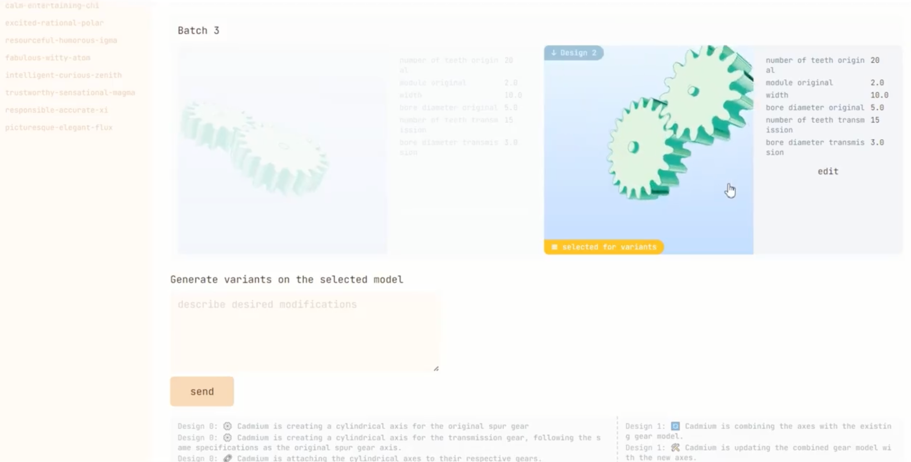

# Cadmium

[](https://github.com/ennucore/cadmium)
[](https://github.com/ennucore/cadmium/issues)
[](https://twitter.com/ennucore)

_CAD models at the speed of thought (or, you know, GPT-4)_

[Announcement tweet and demo](https://twitter.com/ennucore/status/1783946912351027579)
[](https://twitter.com/ennucore/status/1783946912351027579)

## Features and demo

**In this open source agent:**
[](https://twitter.com/ennucore/status/1783946912351027579)

**In the web interface:**
Click to see the demo video with the front-end:
[](https://twitter.com/ennucore/status/1783946912351027579)


## Getting Started
```bash
$ git clone git@github.com:ennucore/cadmium.git
$ cd cadmium
$ conda env create -f environment.yml -n cadmium
$ conda activate cadmium
$ cp .env.example .env
```

After that, edit `.env` to include your [OpenRouter](https://openrouter.ai/) key. That key is sufficient.

You can also use an OpenAI key, but this is less tested.

### Usage
Now, to run it (if you have conda activated):
```bash
$ python cadmium
Enter a prompt for the agent: 
```

It will show you updates, then give you the STL path in the end. You can type `o`/`open` to open the STL file in your default viewer.

If you want the agent to look at it and improve it, just press enter, and it will run another iteration.

If you want to change something, write a message to the agent.
