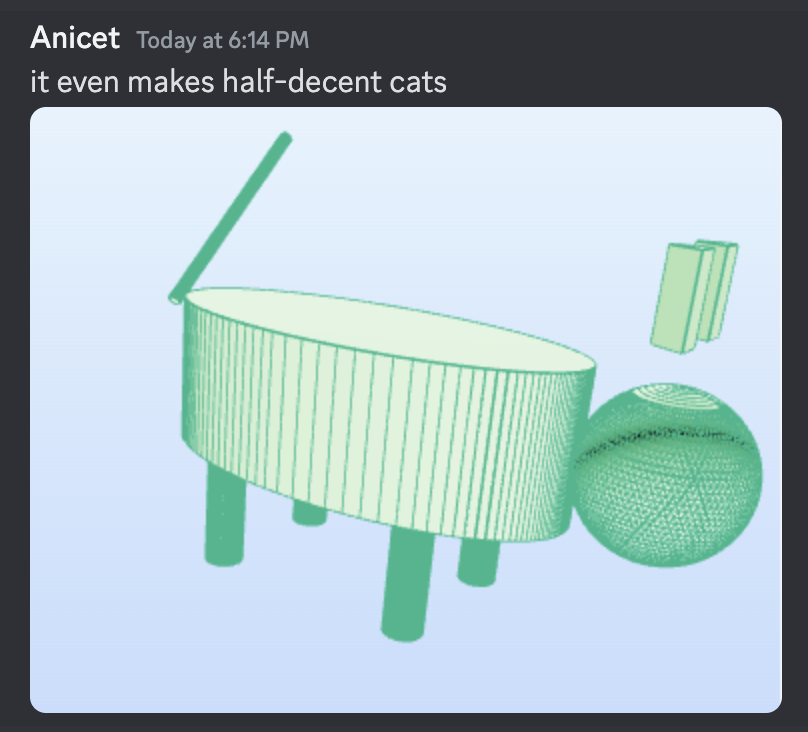

</img>
# Cadmium

[](https://github.com/ennucore/cadmium)
[](https://github.com/ennucore/cadmium/issues)
[](https://twitter.com/ennucore)

_CAD models at the speed of thought (or, you know, GPT-4)_

[Announcement tweet and demo](https://twitter.com/ennucore/status/1783946912351027579)
[](https://twitter.com/ennucore/status/1783946912351027579)

## Features and demo

**In this open source agent:**
[](https://twitter.com/ennucore/status/1783946912351027579)
- Generate the model based on a prompt (see how it works below)
- Incrementally improve the model based on feedback
- The agent can see the model and improve it

Implemented but not used in the CLI:
- Extracting and changing parameters of the model (e.g., table width, height, etc.)
- Picking the best model from multiple generated models using the vision model

**In the web interface:**

- All the CLI features
- A more user-friendly interface (click on the image below)
- Multiple models are generated, the user can pick the best one - like in v0.dev
- The user can see and change the parameters of the model

Click to see the demo video with the front-end:
[](https://twitter.com/ennucore/status/1783946912351027579)


## Getting Started
```bash
$ git clone git@github.com:ennucore/cadmium.git
$ cd cadmium
$ conda env create -f environment.yml -n cadmium
$ conda activate cadmium
$ cp .env.example .env
```

After that, edit `.env` to include your [OpenRouter](https://openrouter.ai/) key. That key is sufficient.

You can also use an OpenAI key, but this is less tested.

### Usage
Now, to run it (if you have conda activated):
```bash
$ python cadmium
Enter a prompt for the agent: 
```

It will show you updates, then give you the STL path in the end. You can type `o`/`open` to open the STL file in your default viewer.

If you want the agent to look at it and improve it, just press enter, and it will run another iteration.

If you want to change something, write a message to the agent.

## How it works

Cadmium is a GPT-4 agent that can generate CAD models from text prompts. It uses OpenAI's GPT-4 or OpenRouter's API to generate and optimize CAD models.

Model generation is done in the following way:

1. The user provides a text prompt.
2. The agent writes code using the [cadquery](https://cadquery.readthedocs.io/) library that generates the CAD model. In the prompt, we provide some examples and advice.
3. We execute the code and generate the STL file. If it fails, the agent will try to fix it.
4. If the user is not satisfied and wants to change the model or just improve it incrementally (enter in the CLI), we:
   - Render the STL from different viewpoints
   - Provide the images (and optionally the user's comments) to the agent
   - The agent will try to improve the model based on the feedback
